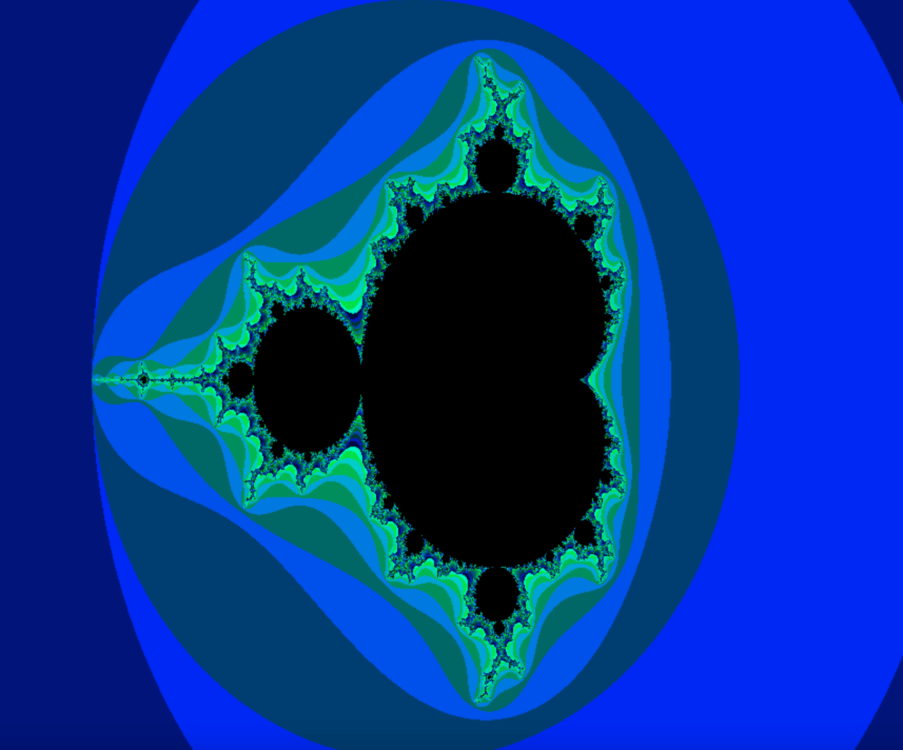
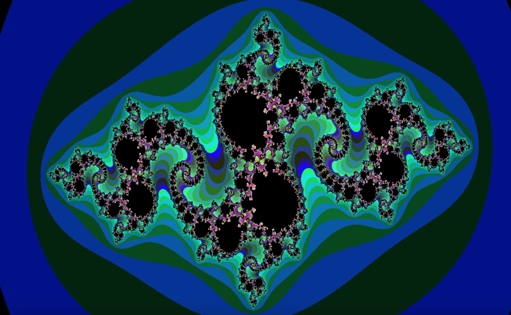
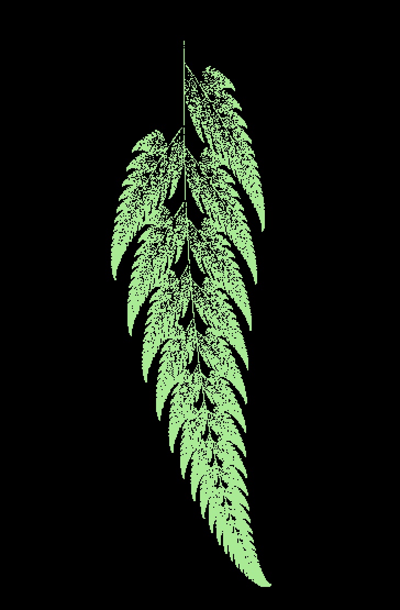

<h2 align="center">Hi 👋, I'm Salama Almansoori</h2>
<h3 align="center">Dev/student at 42abudhabi</h3>

- 👨‍💻 All of my projects are available at [https://github.com/s-almanso](https://github.com/s-almanso)

- 📫 How to reach me **salmanso@student.42abudhabi.ae**

# Fract'ol  42

## Overview

A fractal is a never-ending pattern. Fractals are infinitely complex patterns that are self-similar across different scales. They are created by repeating a simple process over and over in an ongoing feedback loop.

Driven by recursion, fractals are images of dynamic systems – the pictures of Chaos. Geometrically, they exist in between our familiar dimensions. Fractal patterns are extremely familiar, since nature is full of fractals. For instance: trees, rivers, coastlines, mountains, clouds, seashells, hurricanes, etc. Abstract fractals – such as the Mandelbrot Set – can be generated by a computer calculating a simple equation over and over
### Mandelbrot


### Julia


### Barnsley Fern



### Installation

In order to use this run the code you need the minilibx library used in 42! it is already provided with the code. Note: Runs on OS X and Linux.

First, clone this repository to your local machine:
```
git clone https://github.com/s-almanso/42Cursos-Fractol
```

After cloning go to the fractol folder

```
cd 42Cursos-Fractol
```
Run Make so you can build the fractol, minilibx is included.
it will also make a static library.
```
make all
```
Run it with `./fractol [fractal]`. Possible fractals are: `Mandelbrot`, `Julia`, `Fern`.
```
./fractol Mandelbrot
```
To view the Julia set you need to specifiy the value of the constant
```
./fractol Julia -0.8 0.1543
```
Clean output objects with
```
make fclean
```
____


## Features
* Render different fractals: Mandelbrot, Julia, Fern
* Different color schemes by clicking 1, 2, 3 on your keyboard
* Zoom-in & out using the mouse wheel or by clicking
* Use Arrow keys to move around the fractal


<h3 align="left">Connect with me:</h3>
<p align="left">
<a href="https://twitter.com/_thesalama" target="blank"></a>
<a href="https://instagram.com/batsaam_" target="blank"></a>
</p>

<h3 align="left">Languages and Tools:</h3>
<p align="left"> <a href="https://www.arduino.cc/" target="_blank" rel="noreferrer">  </a> <a href="https://www.cprogramming.com/" target="_blank" rel="noreferrer">  </a> <a href="https://www.docker.com/" target="_blank" rel="noreferrer">  </a> <a href="https://git-scm.com/" target="_blank" rel="noreferrer">  </a> <a href="https://www.linux.org/" target="_blank" rel="noreferrer">  </a> <a href="https://www.mathworks.com/" target="_blank" rel="noreferrer">  </a> <a href="https://pandas.pydata.org/" target="_blank" rel="noreferrer">  </a> <a href="https://www.python.org" target="_blank" rel="noreferrer">  </a> <a href="https://pytorch.org/" target="_blank" rel="noreferrer">  </a> <a href="https://scikit-learn.org/" target="_blank" rel="noreferrer">  </a> <a href="https://seaborn.pydata.org/" target="_blank" rel="noreferrer">  </a> <a href="https://www.tensorflow.org" target="_blank" rel="noreferrer">  </a> </p>
